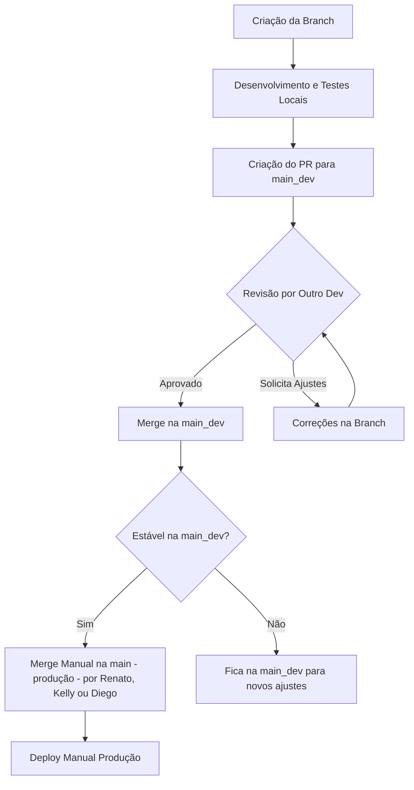

# Projetos Desenvolvimento Web

O desenvolvimento das plataformas web (ex.: CoNekT Grasses) seguirá esse fluxo:


---

## Coordenadores de projetos

 * [Dr. Renato A. Corrêa dos Santos](https://github.com/SantosRAC)
 * [Dra. Kelly Hidalgo](https://github.com/khidalgo85)
 * [Dr. Diego Mauricio Riaño-Pachón](https://github.com/diriano)

---

## Critérios para Avaliação de Pull Requests (PRs)

### Requisitos mínimos para aprovação:

- **Revisões obrigatórias:** Pelo menos **uma revisão de outro desenvolvedor** antes do merge.
- **Conferência manual de testes:** O autor deve rodar todos os testes localmente e garantir que estão passando.
- **Análise de qualidade de código:**
  - Clareza, legibilidade e aderência às boas práticas (Clean Code, [PEP 8](https://peps.python.org/pep-0008/)).
  - Organização e padronização dos arquivos e métodos.
- **Validação de aderência a padrões:**
  - **Branches:** Devem seguir a convenção definida.
  - **Commits:** Devem seguir o padrão estabelecido.
- **Validação manual (se aplicável):**
  - Verificar pontos críticos de **segurança** (ex.: SQL Injection, má configuração de permissões).
  - Avaliar **performance** em trechos sensíveis ou alterações que afetam consultas e grandes volumes de dados.

---

## Fluxo de Avaliação de PRs

### Descrição do fluxo:

1. Criação da branch (`feature/`, `bugfix/` ou `hotfix/`).
2. Desenvolvimento e testes locais.
3. Criação do Pull Request (PR) **sempre contra `main_dev`**.
4. Revisão obrigatória por pelo menos um outro desenvolvedor.
5. O PR pode ser:
   - **Aprovado:** Se atende a todos os critérios.
   - **Solicitado ajuste:** Se há melhorias necessárias.
6. Após aprovação, merge na `main_dev`.
7. Quando a `main_dev` estiver estável, membros **Renato, Kelly ou Diego** fazem o merge manual para a `main` (produção).
8. O deploy é realizado manualmente a partir da branch `main`.

---

### Diagrama de Fluxo



---

## Padrões de Branch

### Estrutura de Branches

| Branch      | Descrição                               | Permissão                                  |
| ----------- | --------------------------------------- | ------------------------------------------ |
| `main`      | Produção                                | Apenas Renato, Kelly e Diego               |
| `main_dev`  | Desenvolvimento principal               | Todos os desenvolvedores                   |
| `feature/*` | Novas funcionalidades                   | Todos                                      |
| `bugfix/*`  | Correções de bugs                       | Todos                                      |
| `hotfix/*`  | Correções emergenciais direto para main | Renato, Kelly e Diego (ou caso autorizado) |

---

## Padrões de Commit

### Convenção: **Conventional Commits Adaptado**

**Formato:**

```
<tipo>(escopo opcional): <mensagem curta>
```

### Tipos comuns:

- `feat`: Nova funcionalidade
- `fix`: Correção de bug
- `chore`: Tarefa de manutenção (ex.: configs, ajustes não relacionados à lógica)
- `docs`: Documentação
- `test`: Adição ou modificação de testes
- `refactor`: Refatoração (sem alteração de funcionalidade)
- `perf`: Melhorias de performance
- `style`: Ajustes de formatação, sem mudança de lógica (espaços, indentação, etc.)
- `build`: Alterações em ferramentas de build, dependências

### Exemplos:

- `feat(user): add user edit page`
- `fix(login): fix authentication bug`
- `docs(readme): update installation instructions`
- `refactor(database): optimize queries in the User model`
- `test(user): add unit tests for creation`
- `style: adjust indentation in app.py file`

---

## Boas Práticas de Desenvolvimento

### Tratamento de Exceções

- Use `try/except` nos pontos críticos (transações, integração externa).
- Registre logs de erros significativos.

### Manutenção de Legibilidade

- Funções curtas e com responsabilidade única.
- Nomeclatura clara e descritiva.
- Comentários apenas quando necessário (preferencialmente código autoexplicativo).

### Aplicação dos Princípios

- **PEP 8:** Seguir o guia de estilo para código Python, garantindo legibilidade e consistência. Isso inclui boas práticas como nomes de variáveis descritivos, indentação correta (4 espaços), separação entre funções e classes, uso adequado de quebras de linha, organização dos imports e padrões para nomes de funções, classes e constantes.
- **Clean Code:** Manter o código limpo, legível e intuitivo. Evitar repetições, nomes confusos e códigos desnecessários.

---

## Diretrizes de Testes

### Tipos de Testes

- **Unitários:** Testam funções isoladas.
- **Integração:** Testam integração entre componentes (ex.: rotas + banco).

### Critérios Mínimos

- **100% dos testes devem passar localmente antes de abrir PR.**
- Não há verificação automática (CI/CD), portanto a **responsabilidade é do desenvolvedor**.
